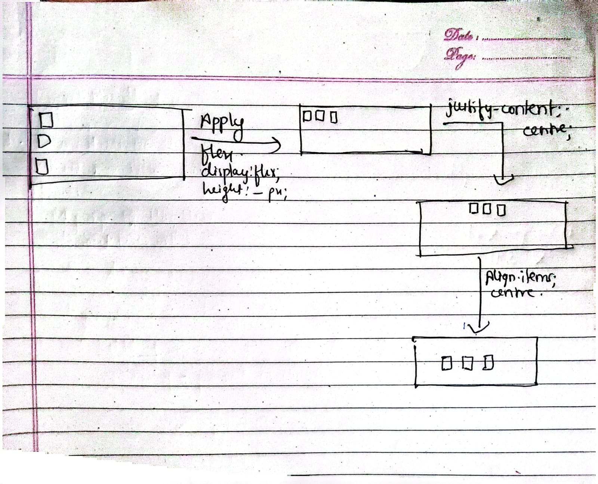
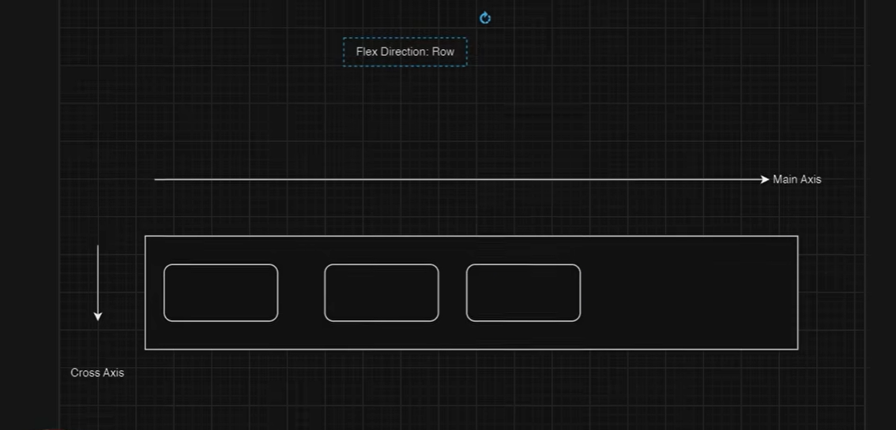

# HTML and CSS
-[X] semantic structure\
-[] flexbox and grid\
-[] Responsive Design\
-[] Typography and visual hierarchy


## 1. Semantic structure
**It is used to describe its meaning to both browser and developers**


### a. Header tag
**It is used for the represent the top section.**

#### a1. nav tag
**It is used for the navigation bar content inside header tag.**

``` 
<header>
    <nav> 
        <li>Home</li>
        <li>About</li>
        <li>Contact</li>
    </nav>
</header>
```

### b. Main tag
All the content of the website goes here.

```
    <main>
        <section>
            <h1>Welcome to My Website</h1>
            <p>This is a simple paragraph for demonstration purposes.</p>
        </section>
        <section>
            <h2>About Me</h2>
            <p>Here is some information about me.</p>
        </section>

        <aside>
            <h3>Related Links</h3>
            <ul>
                <li><a href="#">Link 1</a></li>
                <li><a href="#">Link 2</a></li>
                <li><a href="#">Link 3</a></li>
            </ul>
        </aside>    

        <article>
            <h2>Latest News</h2>
            <p>This is an article about the latest news.</p>    
        </article>
        
    </main>
```

### c. Footer tag
It represents the footer of the website, can contain copyright information, any important links and information.

```
<footer>
    Copyright &copy; 2024
</footer>
```

### d. Figure and figcaption
**It is used for images and illustrations.and for caption for the image.**

```
        <figure>
            
            <figcaption>This is a caption for the image.</figcaption>
        </figure>
```


Further information of other tags are described in the image below:


**Why semantic tags?**
- SEO
- improve accessibility
- Make browser easy to understand

## Resources used
Video:\
codeWithHarry - [
Semantic Tags in HTML, Sigma Web Development Course](https://www.youtube.com/watch?v=fhoDRB53DwY)

Documentation:\
w3school-
[semantic elements in HTML](https://www.w3schools.com/html/html5_semantic_elements.asp)

## 2. Flexbox and grid

### a. Flexbox layout
**It is a css layout model that allows you to arrange the items within the container in a flexible and responsive way.**

#### Why flexbox?
-Simple alignment\
-Adaptive spacing (expand,shrink,wrap within available space)\
-Component friendly (build navbars, cards, forms etc.)

**a. Creating a flex container**

Enable flexbox by setting:
```
display: flex;
```
*By default left to right*

To chnage the direction:
```
flex-direction: column;
```
Justifying the content:
horizontally:
```
justify-content: center;
```

vertically
```
align-items: center;
```




**b. Flex wrap**\
problems like overflowing and too much content, flex wrap can solve this.

```
flex-wrap: wrap;
```
aligining Multiple lined items:
```
align-content: center;
```
If we want gap between items:
```
gap: 2px;
row-gap: 2px;
column-gap: 3px;
```
**c. Flex-flow**
```
flex-flow: row wrap;
```
**Item properties:**\
**a. Order**
```
order: 1;
```

**b. flex-grow and shrink**
Grow the item accordingly

```
flex-grow: 2;
```
Now the item wil take or will grow up to 2 item, or expand  up to 2 item.

## Resources used
Video:\
codeWithHarry - [
CSS flexbox, Sigma Web Development Course](https://www.youtube.com/watch?v=DWk2mndNTHY&t=57s)