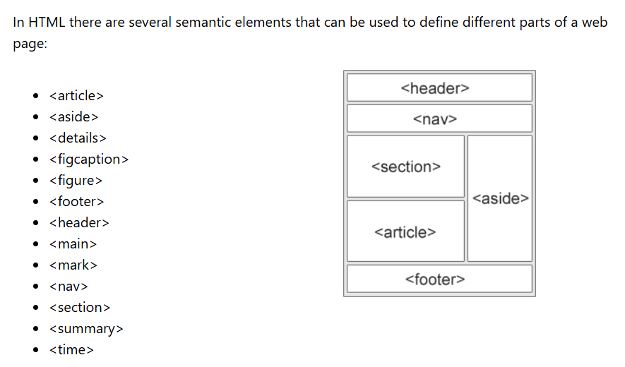
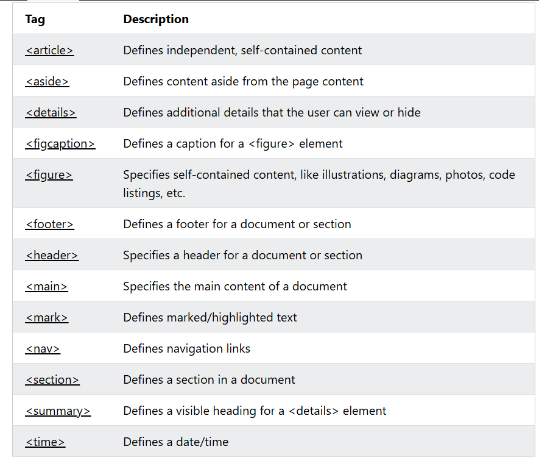

# HTML and CSS
-[X] semantic structure\
-[] flexbox and grid\
-[] Positioning\
-[] Responsive Design\
-[] Typography and visual hierarchy


## Day1- Semantic structure
**It is used to describe its meaning to both browser and developers**




### a. Header tag
**It is used for the represent the top section.**

#### a1. nav tag
**It is used for the navigation bar content inside header tag.**

``` 
<header>
    <nav> 
        <li>Home</li>
        <li>About</li>
        <li>Contact</li>
    </nav>
</header>
```

### b. Main tag
All the content of the website goes here.

```
    <main>
        <section>
            <h1>Welcome to My Website</h1>
            <p>This is a simple paragraph for demonstration purposes.</p>
        </section>
        <section>
            <h2>About Me</h2>
            <p>Here is some information about me.</p>
        </section>

        <aside>
            <h3>Related Links</h3>
            <ul>
                <li><a href="#">Link 1</a></li>
                <li><a href="#">Link 2</a></li>
                <li><a href="#">Link 3</a></li>
            </ul>
        </aside>    

        <article>
            <h2>Latest News</h2>
            <p>This is an article about the latest news.</p>    
        </article>
        
    </main>
```

### c. Footer tag
It represents the footer of the website, can contain copyright information, any important links and information.

```
<footer>
    Copyright &copy; 2024
</footer>
```

### d. Figure and figcaption
**It is used for images and illustrations.and for caption for the image.**

```
        <figure>
            
            <figcaption>This is a caption for the image.</figcaption>
        </figure>
```


Further information of other tags are described in the image below:



**Why semantic tags?**
- SEO
- improve accessibility
- Make browser easy to understand

Resources used:\
Video:\
codeWithHarry - [
Semantic Tags in HTML, Sigma Web Development Course](https://www.youtube.com/watch?v=fhoDRB53DwY)

Documentation:\
w3school-
[semantic elements in HTML](https://www.w3schools.com/html/html5_semantic_elements.asp)